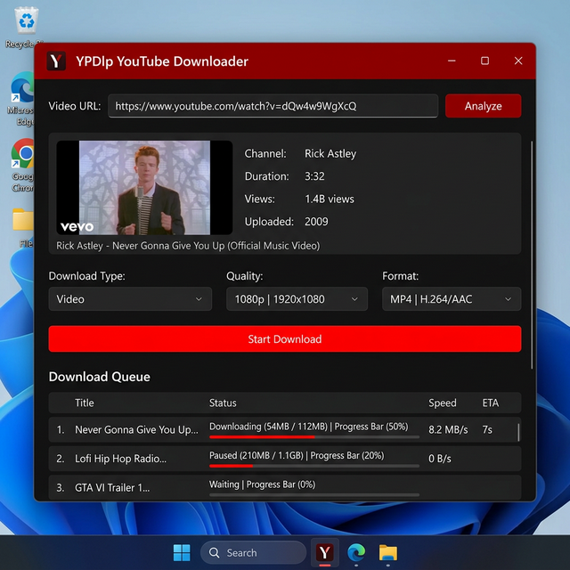

# 🖥️ YPDlp — Desktop YouTube Downloader

A powerful, modern **Windows desktop application** for downloading YouTube videos and audio in any format and quality.



---

## ✨ Features

- 🎬 **Video Download** — MP4, MKV, WebM, AVI
- 🎵 **Audio Extract** — MP3, M4A, FLAC, WAV, OGG, Opus
- 📺 **Quality Selection** — 4K (2160p), 1440p, 1080p, 720p, 480p, 360p
- 📋 **Paste & Go** — Paste URL from clipboard with one click
- 🎯 **Download Queue** — Concurrency queue manager (configurable max downloads)
- 📊 **Progress Tracking** — Real-time progress, speed, and ETA
- 🖼️ **Video Preview** — Thumbnail, title, channel, duration, view count
- ⚙️ **Zero Configuration Required** — Built-in FFmpeg & auto-fallback (no manual PATH setup needed!)
- 🌙 **Dark Theme** — Beautiful modern dark UI with red accents

---

## 🚀 Quick Start (Running from Source)

### 1. Install Dependencies
Double click **`install.bat`** or run:
```bash
pip install -r requirements.txt
```
*(FFmpeg is automatically provided via `imageio-ffmpeg` — no separate FFmpeg download required!)*

### 2. Run the App
Double-click **`run.bat`** or run:
```bash
python main.py
```

---

## 🏗️ Build Standalone Portable Release

Build a self-contained release folder and zip that runs on any Windows PC without Python or FFmpeg installed:

```bash
build.bat
```

Outputs:
- Standalone Folder: `dist/YPDlp/YPDlp.exe`
- Distribution ZIP: `dist/YPDlp_Windows_x64.zip`

---

## 📁 Project Files

| File | Description |
|------|-------------|
| `main.py` | Entry point — launches the app |
| `ui_main.py` | Main window UI and download queue |
| `ui_settings.py` | Settings dialog |
| `downloader.py` | yt-dlp download engine |
| `ffmpeg_utils.py` | Intelligent FFmpeg locator and auto-manager |
| `thumbnail_loader.py` | Async thumbnail fetcher |
| `install.bat` | One-click dependency installer |
| `run.bat` | One-click launcher |
| `build.bat` | One-click release builder & packager |
| `ypdlp.spec` | PyInstaller standalone packaging specification |

---

## 🛠️ Tech Stack

| Technology | Purpose |
|-----------|---------|
| [PyQt6](https://pypi.org/project/PyQt6/) | GUI framework |
| [yt-dlp](https://github.com/yt-dlp/yt-dlp) | Video/audio download engine |
| [imageio-ffmpeg](https://pypi.org/project/imageio-ffmpeg/) | Bundled FFmpeg binary |
| [Pillow](https://pillow.readthedocs.io/) | Image processing |
| [PyInstaller](https://pyinstaller.org/) | Standalone packaging |

---

## ⚠️ Disclaimer

This tool is for **personal and educational use only**. Downloading copyrighted content without permission may violate YouTube's Terms of Service and applicable laws.

---

## 📄 License

MIT License — Feel free to use, modify, and distribute.
